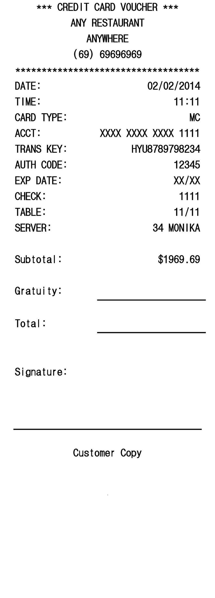

# Doc Transformers
Document processing using transformers. This is still in developmental phase, currently supports only extraction of form data i.e (key - value pairs)

```
pip install -q doc-transformers
```

## Pre-requisites

Please install the following seperately
```
sudo apt install tesseract-ocr
pip install -q detectron2 -f https://dl.fbaipublicfiles.com/detectron2/wheels/cu101/torch1.8/index.html
```

## Implementation

```
# loads the pretrained dataset also 
from doc_transformers import form_parser

# loads the image
image = form_parser.load_image(input_path_image)

# gets the bounding boxes, predictions, extracted words and image processed
bbox, preds, words, image = form_parser.process_image(image)

# returns image and extracted key-value pairs along with title as the output
im, df = form_parser.visualize_image(bbox, preds, words, image)

# process and returns k-v pairs by concatenating relevant strings.
df_main = form_parser.process_form(df)
```

## Results

**Input**

 

**Output**


- Please note that this is still in development phase and will be improved in the near future
